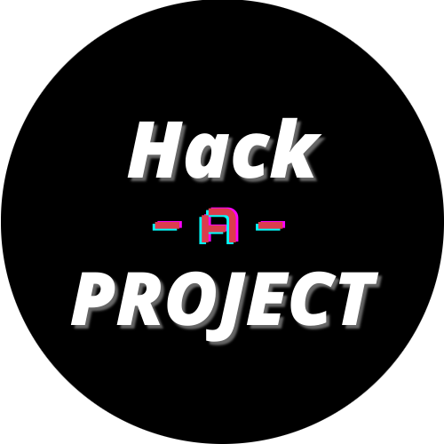
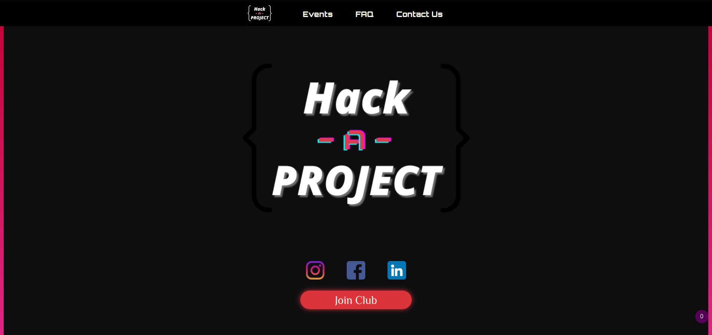
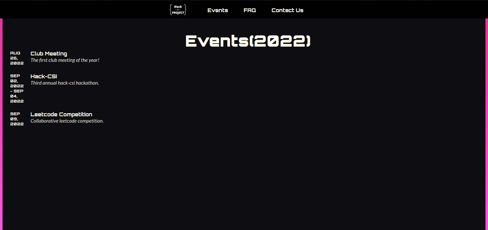
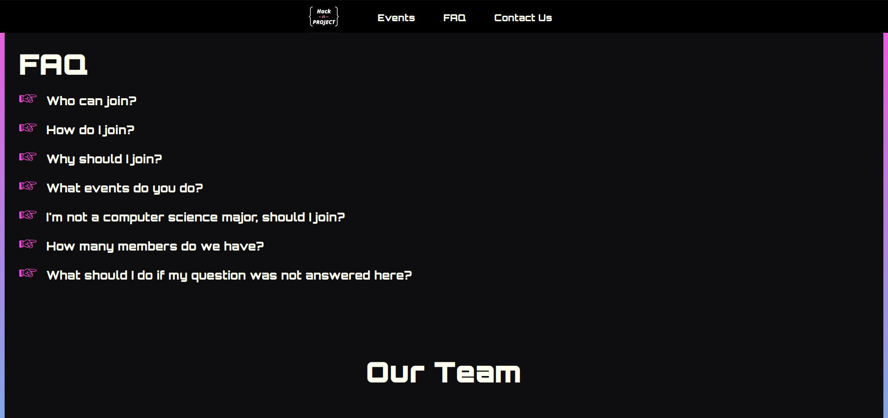

<p align="center"></p>

<h2 align="center"><b>Hack-A-Project Website</b></h2>

<hr>

## Screenshots

[](./src/assets/hack_web1.png)

[](./src/assets/hack_web2.png)

[](./src/assets/hack_web3.png)

## Contributions

All contributions are welcomed, the structure of the website is
intuitively organized. To start making changes to this website clone
the repo and download it, then run

```bash
yarn install && yarn start
```
